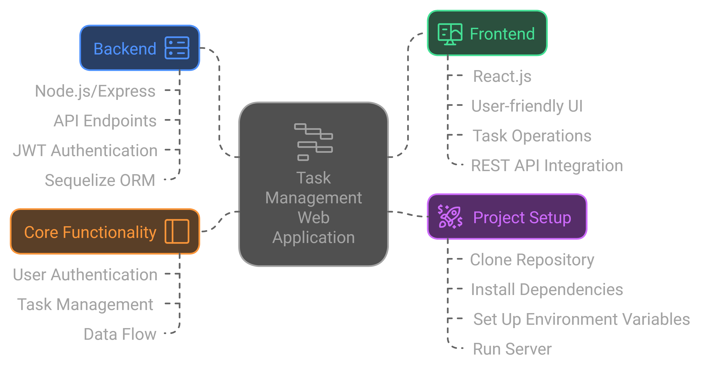

# Task Management Web Application



This Task Management Web Application allows users to sign up, log in, and manage their tasks in a secure and user-friendly environment. The backend is built with Node.js and Express, utilizing Sequelize ORM and JWT-based authentication. The frontend, built with React.js and Tailwind CSS, offers an intuitive interface for managing tasks.

## Features

### Project Structure
- **Backend (Node.js/Express)**: 
  - API endpoints for user authentication and task management
  - Middleware-based JWT authentication to secure access
  - Sequelize ORM for structured data interactions with a relational database

- **Frontend (React.js)**:
  - User-friendly UI for managing tasks
  - Allows task creation, updating, deletion, and viewing via paginated lists
  - REST API integration with the backend

### Core Functionality

#### User Authentication:
- **Sign Up**: Register with a unique username and password
- **Login**: Authenticate to receive a JWT token
- **JWT Verification**: Middleware-secured routes ensure only logged-in users can interact with tasks

#### Task Management:
- **Create Task**: Users can add tasks with attributes like title, description, status, and priority
- **View Tasks**: Paginated list for scalable task access
- **Update Task**: Edit task details as needed
- **Delete Task**: Remove tasks from the list

#### Data Flow
- **User Sign Up/Login**: On successful signup or login, a JWT token is generated for secure interactions.
- **Task Operations**: Create, read, update, and delete tasks using API requests. Pagination is implemented to manage larger task lists.

## Project Setup

1. **Clone the repository**:
   ```bash
   git clone https://github.com/your-username/task-management-app.git
   cd task-management-app
   ```

2. **Install dependencies**:
   ```bash
   npm install
   ```

3. **Set up environment variables**:
   - Create a `.env` file with the following keys:
     ```
     DB_NAME=your_databaseName
     DB_USER=root
     DB_PASSWORD=your_password
     DB_HOST=localhost
     DB_PORT=3306
     JWT_SECRET=set_JWT_secret_code
     ```

4. **Run the server**:
   ```bash
   npm start
   ```

## API Documentation

### Authentication
- **POST** `/api/signup` - Register a new user
- **POST** `/api/login` - Login to receive a JWT token

### Task Management
- **GET** `/api/tasks?page=1&limit=10` - Retrieve a paginated list of tasks
- **POST** `/api/tasks` - Create a new task
- **PUT** `/api/tasks/:id` - Update a specific task
- **DELETE** `/api/tasks/:id` - Delete a specific task

## Future Enhancements
- **Enhanced Filtering and Sorting**: Sort by priority or filter by status
- **Password Reset Feature**: Add a password reset option for users
- **Frontend Testing**: Unit and integration tests for React components
- **Deployment**: Deploy the application on a cloud platform

## Contributing
Contributions are welcome! Feel free to submit issues, feature requests, or pull requests.
